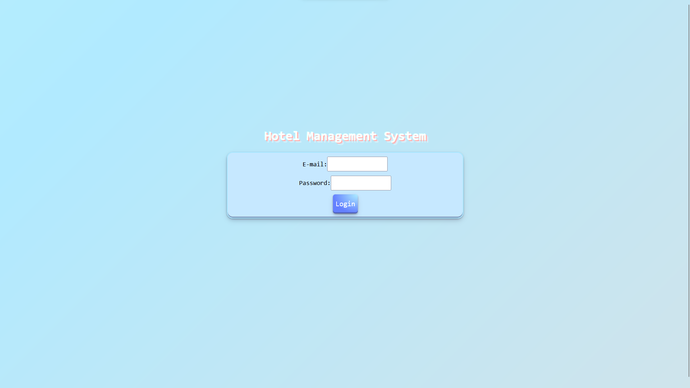
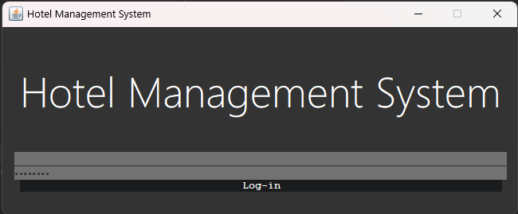

# <!--fit--> Hotel Management System
<span style="color:gray">By:</span> Berkan Kumas and Ibrahim Aboussa

---

## Goals of the project

* We will make a hotel database and write applications for it that can view, edit and add data to the database

* We will make a web-based application that runs on a browser and desktop

---

# Roadmap

* First, we will design and then create the database
* We will write the code for the desktop application and then connect it to the database
* Same as previous step but for the web.

---

# Tools we have used

- <span style="font-weight:bold">Java,HTML,PHP,mySQL,CSS as languages</span>
-> IntelliJ for Java programming. We have used Maven as our project manager.
-> Visual Studio Code for programming PHP.
-> XAMPP for running a server.

---

# Connecting to our database

We have used a JDBC for connecting to our Java code. PHP has it already built-in.

---

# Java code for connecting

```Java
Connection con = DriverManager.getConnection("jdbc:mysql://localhost:3306/hotelChart","root","");
```

# PHP code for connecting
```PHP
$conn = mysqli_connect($host, $user, $password, $db_name);
```
<span style="font-size:small; color:gray;">PHP connection is found in "sqlconfig.php"</span>

---

# Interfaces


Website login interface

Java login interface

---

# Improvements can be made
Here are some of them:
- The two UI's can have same design.
- Security can be improved.
- The file locations and namings are a mess it could be cleaned up.